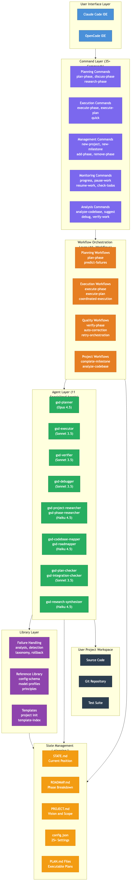
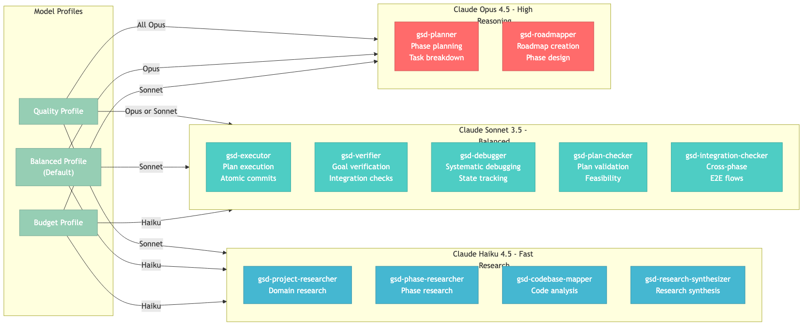
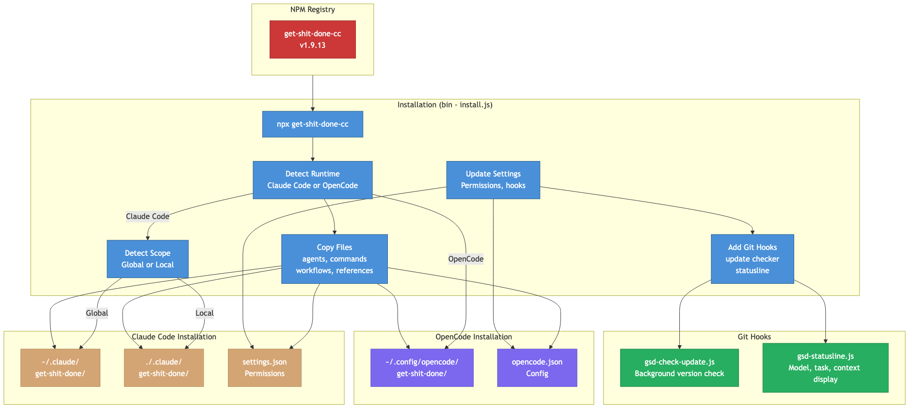
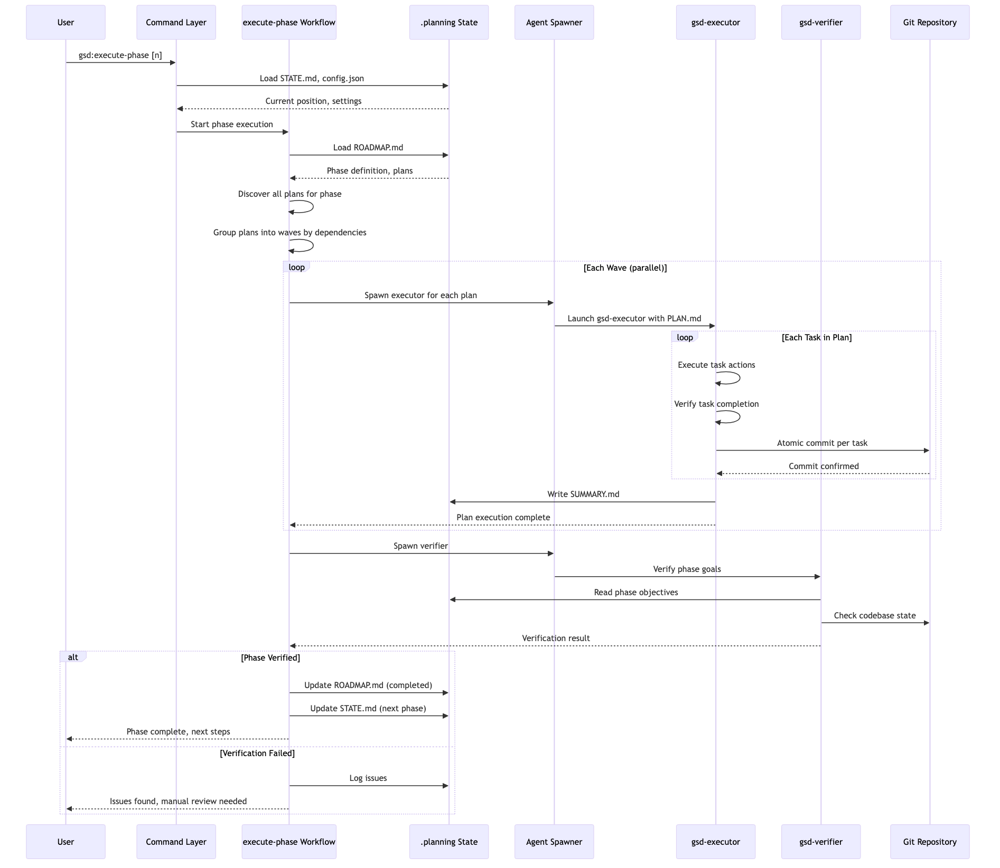
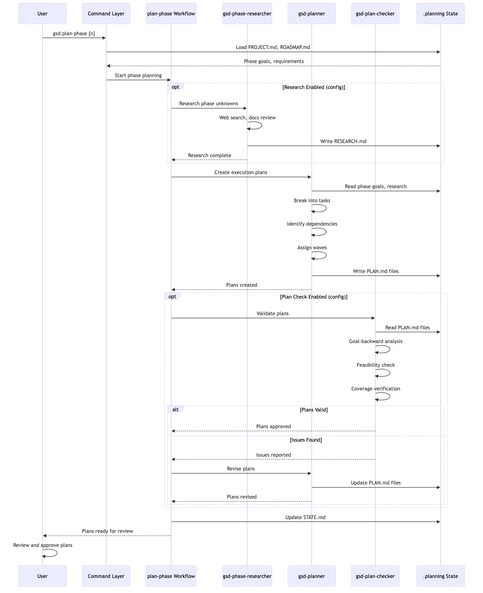
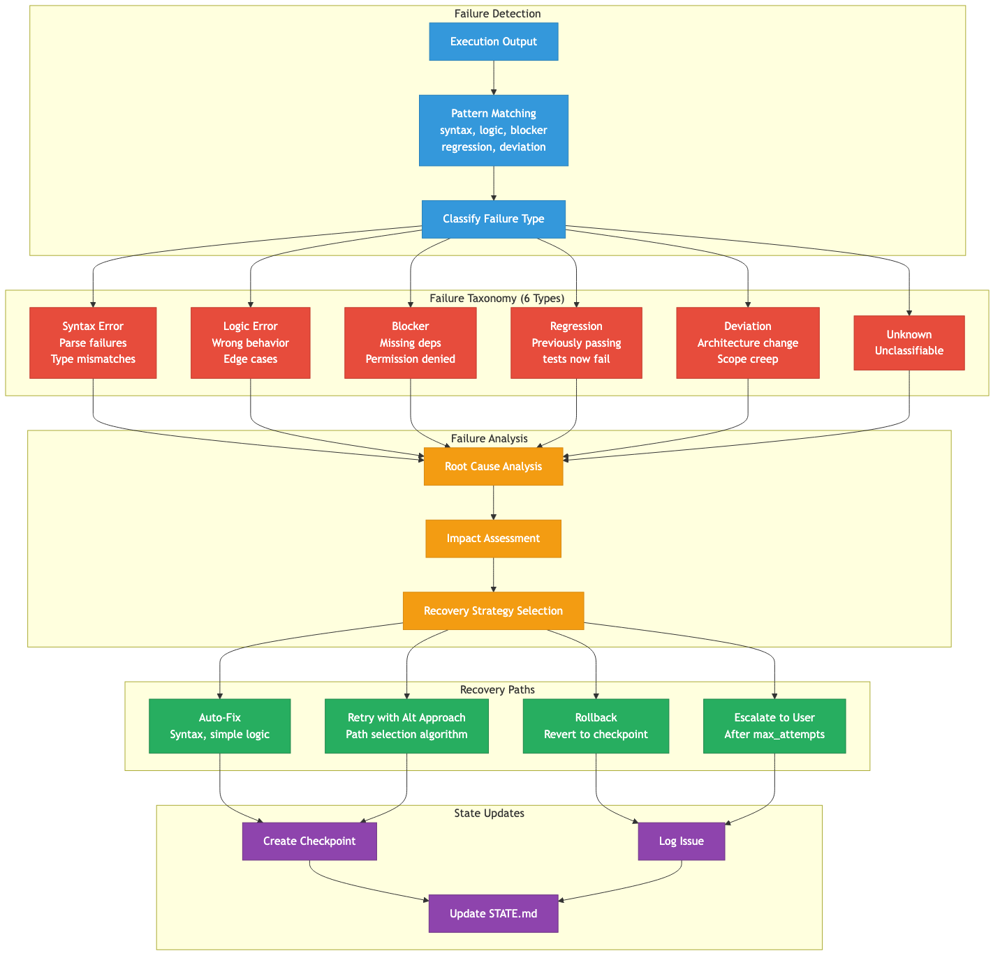
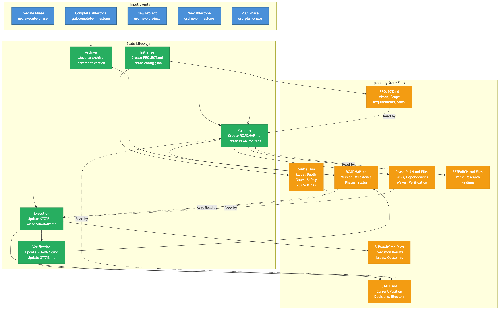
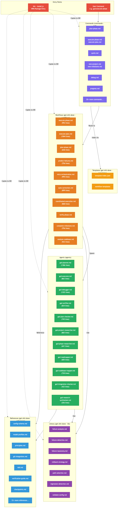
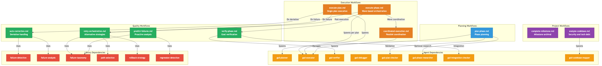
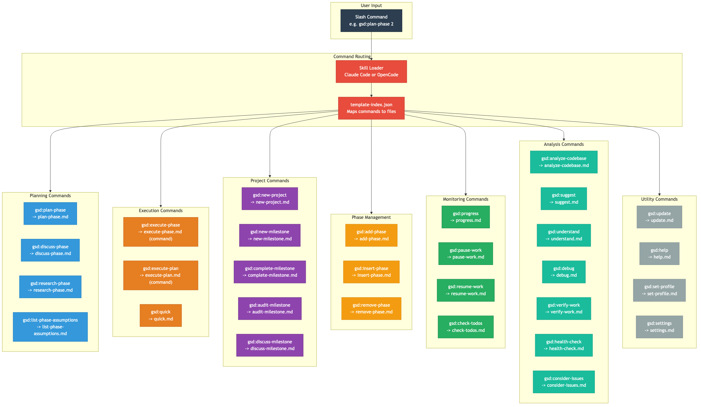

# Get Shit Done - Codebase Diagrams

**Generated:** 2026-01-28

## Architecture Diagrams

### 1. System Overview (`arch-01-system-overview`)
Complete layered architecture showing UI, Command, Workflow, Agent, Library, and State layers with their interactions.

### 2. Agent Model Allocation (`arch-02-agent-model-allocation`)
How 11 specialized agents map to Claude model tiers (Opus, Sonnet, Haiku) across quality/balanced/budget profiles.

### 3. Installation Architecture (`arch-03-installation-architecture`)
NPM package installation flow for Claude Code and OpenCode runtimes with global/local scope options.

## Data Flow Diagrams

### 4. Phase Execution Flow (`dataflow-01-phase-execution`)
Sequence diagram showing complete phase execution from user command through wave-based parallel execution to verification.

### 5. Planning Flow (`dataflow-02-planning-flow`)
Sequence diagram showing phase planning from research through plan creation and validation.

### 6. Failure Handling Flow (`dataflow-03-failure-handling`)
Complete failure handling pipeline from detection through taxonomy classification to recovery paths.

### 7. State Management (`dataflow-04-state-management`)
How .planning state files (PROJECT, ROADMAP, STATE, CONFIG, PLANS) are created and updated through the project lifecycle.

## Module Dependency Graphs

### 8. Core Module Dependencies (`module-01-core-dependencies`)
How entry points, commands, workflows, agents, library, references, and templates depend on each other.

### 9. Workflow Dependencies (`module-02-workflow-dependencies`)
Internal dependencies between execution, quality, planning, and project workflows and the agents/libraries they use.

### 10. Command Routing (`module-03-command-routing`)
Complete map of all 35+ slash commands organized by category and how they route through template-index.json.

