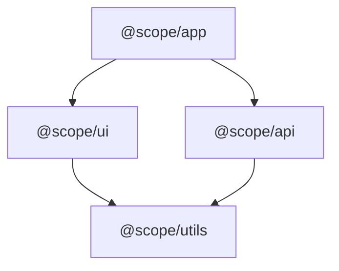
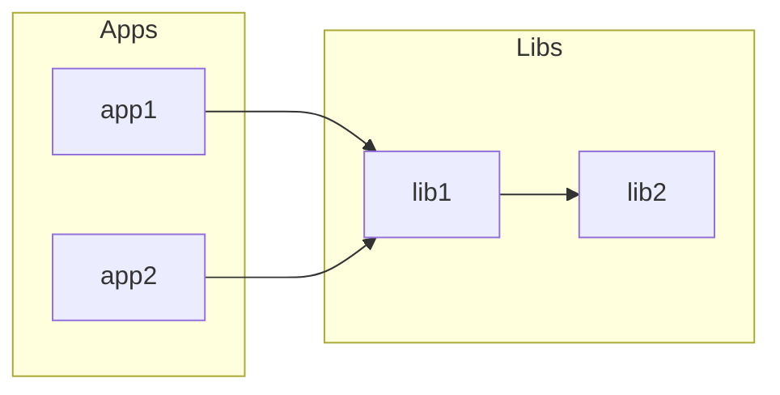

# Monorepo Patterns Reference

Reference document for monorepo detection, workspace configuration, and dependency graph concepts.

## Config File Patterns

### pnpm-workspace.yaml

**Location:** Root directory
**Format:** YAML

```yaml
packages:
  # Standard patterns
  - 'packages/*'
  - 'apps/*'
  - 'libs/*'

  # Negation (exclude)
  - '!packages/internal-*'

  # Nested patterns
  - 'packages/*/sub/*'
```

**Key fields:**
- `packages`: Array of glob patterns for workspace packages

**Detection snippet:**
```bash
if [ -f pnpm-workspace.yaml ]; then
  echo "pnpm workspaces detected"
fi
```

---

### turbo.json (Turborepo)

**Location:** Root directory
**Format:** JSON

```json
{
  "$schema": "https://turbo.build/schema.json",
  "pipeline": {
    "build": {
      "dependsOn": ["^build"],
      "outputs": ["dist/**", ".next/**"]
    },
    "test": {
      "dependsOn": ["build"],
      "outputs": []
    },
    "lint": {
      "outputs": []
    }
  },
  "globalDependencies": [
    ".env",
    "tsconfig.json"
  ]
}
```

**Key fields:**
- `pipeline`: Task definitions with dependencies
- `globalDependencies`: Files that invalidate all caches
- `globalEnv`: Environment variables that affect all tasks

**Detection snippet:**
```bash
if [ -f turbo.json ]; then
  # Check if using pnpm or npm workspaces
  if [ -f pnpm-workspace.yaml ]; then
    echo "pnpm+turborepo"
  elif grep -q '"workspaces"' package.json 2>/dev/null; then
    echo "npm+turborepo"
  else
    echo "turborepo"
  fi
fi
```

**Note:** Turborepo is a task runner, not a package manager. It works with pnpm, npm, or yarn workspaces.

---

### nx.json (Nx)

**Location:** Root directory
**Format:** JSON

```json
{
  "$schema": "./node_modules/nx/schemas/nx-schema.json",
  "targetDefaults": {
    "build": {
      "dependsOn": ["^build"],
      "cache": true
    },
    "test": {
      "cache": true
    }
  },
  "namedInputs": {
    "default": ["{projectRoot}/**/*"],
    "production": ["default", "!{projectRoot}/**/*.spec.ts"]
  },
  "plugins": [
    "@nx/vite/plugin",
    "@nx/eslint/plugin"
  ]
}
```

**Legacy format (Nx < 15):**

```json
{
  "projects": {
    "app": "apps/app",
    "lib": "libs/lib"
  }
}
```

**Or workspace.json:**

```json
{
  "version": 2,
  "projects": {
    "app": "apps/app",
    "lib": "libs/lib"
  }
}
```

**Key fields:**
- `targetDefaults`: Default task configurations
- `namedInputs`: Input sets for caching
- `plugins`: Auto-discovery plugins

**Detection snippet:**
```bash
if [ -f nx.json ]; then
  echo "nx detected"
fi
```

---

### lerna.json (Lerna)

**Location:** Root directory
**Format:** JSON

```json
{
  "$schema": "node_modules/lerna/schemas/lerna-schema.json",
  "version": "independent",
  "packages": [
    "packages/*"
  ],
  "npmClient": "npm",
  "useWorkspaces": true
}
```

**Key fields:**
- `packages`: Glob patterns for package locations
- `version`: "independent" or fixed version string
- `npmClient`: "npm", "yarn", or "pnpm"
- `useWorkspaces`: Use package manager workspaces

**Note:** Lerna is now powered by Nx. Legacy Lerna without Nx is essentially unmaintained.

**Detection snippet:**
```bash
if [ -f lerna.json ]; then
  echo "lerna detected"
fi
```

---

### rush.json (Rush)

**Location:** Root directory
**Format:** JSON

```json
{
  "$schema": "https://developer.microsoft.com/json-schemas/rush/v5/rush.schema.json",
  "rushVersion": "5.100.0",
  "pnpmVersion": "8.6.0",
  "nodeSupportedVersionRange": ">=18.0.0",
  "projects": [
    {
      "packageName": "@scope/app",
      "projectFolder": "apps/app"
    },
    {
      "packageName": "@scope/lib",
      "projectFolder": "libs/lib"
    }
  ]
}
```

**Key fields:**
- `projects`: Array of project definitions
- `rushVersion`: Rush CLI version
- `pnpmVersion`: Managed pnpm version

**Detection snippet:**
```bash
if [ -f rush.json ]; then
  echo "rush detected"
fi
```

---

### package.json (npm/yarn/bun workspaces)

**Location:** Root directory
**Format:** JSON (workspaces field)

```json
{
  "name": "monorepo-root",
  "private": true,
  "workspaces": [
    "packages/*",
    "apps/*"
  ]
}
```

**Alternative format (yarn 2+ with object):**

```json
{
  "workspaces": {
    "packages": [
      "packages/*"
    ],
    "nohoist": [
      "**/react-native"
    ]
  }
}
```

**Key fields:**
- `workspaces`: Array of glob patterns (or object with packages array)
- `private`: Usually true for monorepo roots

**Detection snippet:**
```bash
if grep -q '"workspaces"' package.json 2>/dev/null; then
  echo "npm/yarn/bun workspaces detected"
fi
```

---

## Workspace Glob Patterns

### Standard Patterns

| Pattern | Matches | Common Use |
|---------|---------|------------|
| `packages/*` | packages/pkg-a, packages/pkg-b | Shared libraries |
| `apps/*` | apps/web, apps/mobile | Applications |
| `libs/*` | libs/ui, libs/utils | Reusable modules |
| `tools/*` | tools/cli, tools/scripts | Internal tooling |

### Negation Patterns

```yaml
packages:
  - 'packages/*'
  - '!packages/internal-*'    # Exclude internal packages
  - '!packages/deprecated'    # Exclude specific package
```

### Nested Patterns

```yaml
packages:
  - 'packages/*'
  - 'packages/*/plugins/*'    # packages/core/plugins/auth
  - '**/package.json'         # Any directory with package.json
```

### Glob Expansion

**Using bash:**
```bash
for pattern in packages/* apps/*; do
  for dir in $pattern; do
    if [ -f "$dir/package.json" ]; then
      echo "Found package: $dir"
    fi
  done
done
```

**Using Node.js (glob package):**
```javascript
const glob = require('glob');
const patterns = ['packages/*', 'apps/*'];

patterns.forEach(pattern => {
  glob.sync(pattern).forEach(dir => {
    console.log(`Found: ${dir}`);
  });
});
```

---

## Dependency Graph Concepts

### Directed Graph Representation

A dependency graph is a directed graph where:
- **Nodes** = Workspace packages
- **Edges** = Dependencies (A → B means A depends on B)

```
@scope/app → @scope/ui → @scope/utils
          → @scope/api → @scope/utils
```

### Graph Data Structure

```typescript
interface DependencyGraph {
  // Adjacency list: package → packages it depends on
  dependencies: Record<string, string[]>;

  // Reverse adjacency: package → packages that depend on it
  dependants: Record<string, string[]>;
}
```

**Example:**
```json
{
  "dependencies": {
    "@scope/app": ["@scope/ui", "@scope/api"],
    "@scope/ui": ["@scope/utils"],
    "@scope/api": ["@scope/utils"],
    "@scope/utils": []
  },
  "dependants": {
    "@scope/app": [],
    "@scope/ui": ["@scope/app"],
    "@scope/api": ["@scope/app"],
    "@scope/utils": ["@scope/ui", "@scope/api"]
  }
}
```

### Topological Sort (Build Order)

Topological sort produces an ordering where dependencies come before dependants.

**Algorithm (Kahn's algorithm):**

1. Calculate in-degree for each node (number of dependencies)
2. Add all nodes with in-degree 0 to queue (root packages)
3. While queue not empty:
   - Remove node from queue
   - Add to result
   - For each dependent of node:
     - Decrease in-degree by 1
     - If in-degree becomes 0, add to queue
4. If result contains all nodes, valid order found
5. If nodes remain, cycle exists

**Result for example above:**
```
Build order: @scope/utils → @scope/ui → @scope/api → @scope/app
```

**Implementation pattern (conceptual):**
```javascript
// Using dependency-graph npm package
const { DepGraph } = require('dependency-graph');

const graph = new DepGraph();
graph.addNode('@scope/utils');
graph.addNode('@scope/ui');
graph.addDependency('@scope/ui', '@scope/utils');

const buildOrder = graph.overallOrder();
// ['@scope/utils', '@scope/ui']
```

### Cycle Detection

Cycles occur when A depends on B and B depends on A (directly or transitively).

**Example cycle:**
```
@scope/pkg-a → @scope/pkg-b → @scope/pkg-a  (direct cycle)
@scope/a → @scope/b → @scope/c → @scope/a   (transitive cycle)
```

**Detection approach:**
- During topological sort, if not all nodes are processed, cycle exists
- dependency-graph package throws `DepGraphCycleError` with cycle path

**Handling cycles:**
1. Report the cycle clearly with full path
2. Mark affected packages
3. Warn user that build order may be incorrect
4. Continue discovery (cycles don't prevent analysis)

### Transitive Dependency Lookup

For impact analysis, we need to find all packages affected by changes.

**Direct dependants:** Packages that directly depend on changed package
**Transitive dependants:** All packages reachable via dependant edges

```javascript
// Using dependency-graph
const directDependants = graph.directDependantsOf('@scope/utils');
// ['@scope/ui', '@scope/api']

const allDependants = graph.dependantsOf('@scope/utils');
// ['@scope/ui', '@scope/api', '@scope/app'] (includes transitive)
```

---

## Output Format (MONOREPO_INFO.md)

Template for human-readable monorepo documentation:

```markdown
# Monorepo Information

**Type:** pnpm+turborepo
**Root:** /path/to/monorepo
**Detected:** 2026-01-08T12:00:00Z

---

## Packages

| Name | Path | Version |
|------|------|---------|
| @scope/utils | packages/utils | 1.0.0 |
| @scope/ui | packages/ui | 1.0.0 |
| @scope/api | packages/api | 1.0.0 |
| @scope/app | apps/app | 1.0.0 |

---

## Dependency Graph



---

## Build Order

1. @scope/utils (no dependencies)
2. @scope/ui (depends on: utils)
3. @scope/api (depends on: utils)
4. @scope/app (depends on: ui, api)

---

## Statistics

- **Total packages:** 4
- **Dependency depth:** 3 levels
- **Root packages (no deps):** 1 (@scope/utils)
- **Leaf packages (no dependants):** 1 (@scope/app)

---

*Generated by discover-monorepo workflow*
*Last updated: 2026-01-08T12:00:00Z*
```

### Mermaid Graph Tips

**For large graphs (>20 packages):**
- Show only key paths (longest dependency chains)
- Group related packages into subgraphs
- Consider using LR (left-right) direction



---

## Common Pitfalls

### 1. Diamond Dependency Version Conflicts

**Problem:** Package A needs react@18, Package B needs react@17, both are workspace packages.

**Symptom:** Build failures mentioning version mismatches, "multiple instances" warnings.

**Cause:** Monorepo doesn't enforce version alignment across packages.

**Solution:**
- Use pnpm's strict mode (`pnpm-workspace.yaml` with `linkWorkspacePackages: true`)
- Use Nx's dependency constraints
- Enforce version policy in CI
- Consider single-version policy for core dependencies

---

### 2. Circular Dependencies

**Problem:** Package A depends on B, B depends on A (directly or transitively).

**Symptom:** Infinite loops during resolution, "maximum call stack" errors, unpredictable build order.

**Cause:** Poor package boundaries, shared utilities growing organically.

**Solution:**
- Run cycle detection in CI
- Use dependency-cruiser rules to prevent new cycles
- Refactor cycles by extracting shared code to new package
- Consider whether packages should be merged

---

### 3. False Positive Impact Analysis

**Problem:** Changes to root package.json mark ALL packages as affected.

**Symptom:** Every PR rebuilds entire monorepo, slow CI.

**Cause:** Root package.json changes (scripts, devDeps) don't actually affect packages.

**Reference:** Turborepo issue #11144

**Solution:**
- Filter root package.json from impact analysis
- Only consider actual dependency changes
- Use turbo.json `globalDependencies` carefully
- Check if change is in `dependencies` vs `devDependencies` vs `scripts`

---

### 4. Comparing Against Wrong Git Ref

**Problem:** Changed files list includes commits already on main.

**Symptom:** Impact analysis shows packages you didn't touch.

**Cause:** Using `origin/main` instead of merge-base after rebases.

**Solution:**
```bash
# Correct: Use merge-base for accurate diff
MERGE_BASE=$(git merge-base --fork-point origin/main HEAD 2>/dev/null || git merge-base origin/main HEAD)
git diff --name-only "$MERGE_BASE" HEAD

# Wrong: Direct comparison misses rebase changes
git diff --name-only origin/main HEAD
```

---

### 5. Missing Nested Workspaces

**Problem:** Packages in nested workspace locations aren't discovered.

**Symptom:** "Package not found" for clearly existing packages.

**Cause:** Only checking root workspace config, not nested configs.

**Solution:**
- Recursively scan for workspace configs (if supporting nested)
- Document limitation if not supporting nested
- Most monorepos use single-level workspaces

---

### 6. Including/Excluding devDependencies

**Problem:** Build graph misses packages only connected via devDependencies.

**Symptom:** Test utilities not built before packages that need them.

**Cause:** Only considering `dependencies`, ignoring `devDependencies`.

**Solution:**
- Include BOTH dependencies and devDependencies in graph
- devDependencies matter for: test utils, build tools, types
- Only exclude if specifically filtering for production builds

---

### 7. Private Package Confusion

**Problem:** Uncertainty about whether private packages should be included.

**Clarification:** `"private": true` only affects npm publish, not builds.

**Solution:**
- Include ALL workspace packages in discovery
- Private packages are still built and linked
- Private flag just prevents accidental publish to npm

---

## Detection Snippets

### Complete Detection Function

```bash
detect_monorepo_type() {
  local dir="${1:-.}"

  # Check in priority order
  if [ -f "$dir/pnpm-workspace.yaml" ]; then
    if [ -f "$dir/turbo.json" ]; then
      echo "pnpm+turborepo"
    else
      echo "pnpm"
    fi
  elif [ -f "$dir/turbo.json" ]; then
    if grep -q '"workspaces"' "$dir/package.json" 2>/dev/null; then
      echo "npm+turborepo"
    else
      echo "turborepo"
    fi
  elif [ -f "$dir/nx.json" ]; then
    echo "nx"
  elif [ -f "$dir/lerna.json" ]; then
    echo "lerna"
  elif [ -f "$dir/rush.json" ]; then
    echo "rush"
  elif grep -q '"workspaces"' "$dir/package.json" 2>/dev/null; then
    echo "npm-workspaces"
  else
    echo "single-package"
  fi
}
```

### Get Workspace Patterns

```bash
get_workspace_patterns() {
  local type=$(detect_monorepo_type)

  case "$type" in
    pnpm*)
      grep -A50 "packages:" pnpm-workspace.yaml 2>/dev/null | \
        grep "^\s*-" | \
        sed "s/.*['\"]\\(.*\\)['\"].*/\\1/"
      ;;
    npm-workspaces|*turborepo)
      node -e "
        const pkg = require('./package.json');
        const ws = pkg.workspaces || [];
        (Array.isArray(ws) ? ws : ws.packages || []).forEach(p => console.log(p));
      " 2>/dev/null
      ;;
    lerna)
      node -e "
        const lerna = require('./lerna.json');
        (lerna.packages || ['packages/*']).forEach(p => console.log(p));
      " 2>/dev/null
      ;;
  esac
}
```

---

## References

- [pnpm workspaces documentation](https://pnpm.io/workspaces)
- [Turborepo structuring guide](https://turborepo.com/docs/crafting-your-repository/structuring-a-repository)
- [Nx project configuration](https://nx.dev/reference/project-configuration)
- [dependency-graph npm package](https://www.npmjs.com/package/dependency-graph)
- [Research: 18-RESEARCH.md](.planning/phases/18-monorepo-discovery/18-RESEARCH.md)

---

*Reference document for GSD monorepo discovery*
*Created: 2026-01-08*
