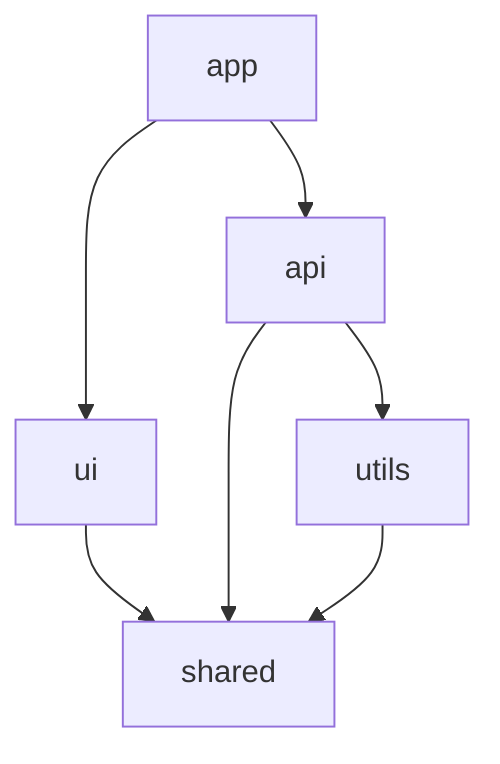
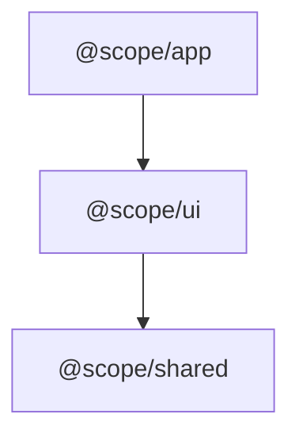
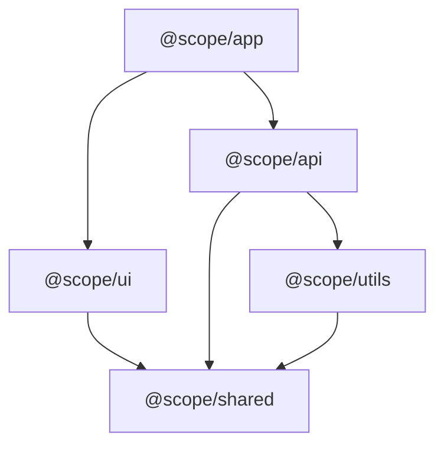

# Monorepo Info Template

Template for `.planning/MONOREPO_INFO.md` - monorepo structure and dependency documentation.

---

## File Template

```markdown
# Monorepo Information

**Type:** {MONOREPO_TYPE}
**Root:** {ROOT_PATH}
**Last Updated:** {TIMESTAMP}
**Package Count:** {PACKAGE_COUNT}

---

## Packages

| Name | Path | Version | Dependencies |
|------|------|---------|--------------|
{PACKAGES_TABLE}

---

## Dependency Graph

```mermaid
graph TD
{DEPENDENCY_GRAPH}
```

**Legend:**
- Arrows point from dependent → dependency
- Packages at bottom have no dependencies (build first)
- Packages at top depend on others (build last)

---

## Build Order

Packages should be built in this order (topological sort):

{BUILD_ORDER_LIST}

**Build in parallel:** Packages at the same depth level with no dependencies between them can be built in parallel.

---

## Statistics

- **Total packages:** {PACKAGE_COUNT}
- **Dependency depth:** {MAX_DEPTH} levels
- **Root packages (no deps):** {ROOT_COUNT}
- **Leaf packages (no dependants):** {LEAF_COUNT}

---

## Impact Analysis

<!-- This section is populated by impact-analysis.md workflow when --impact flag is used -->

**Merge Base:** {MERGE_BASE}
**Analysis Date:** {ANALYSIS_DATE}

### Changed Files

{CHANGED_FILES_COUNT} files changed since merge base:

{CHANGED_FILES_LIST}

### Directly Affected

Packages with file changes:

{DIRECT_AFFECTED_LIST}

### Transitively Affected

Packages that depend on changed packages:

{TRANSITIVE_AFFECTED_LIST}

### Recommended Build Order (Affected Only)

{AFFECTED_BUILD_ORDER}

---

## Raw Data

<details>
<summary>JSON (for automation)</summary>

```json
{RAW_JSON}
```

</details>

---

*Generated by /gsd:discover-monorepo*
*Last updated: {TIMESTAMP}*
```

---

## Variable Reference

| Variable | Source | Description |
|----------|--------|-------------|
| `{MONOREPO_TYPE}` | discover-monorepo.md step 1 | One of: pnpm, pnpm+turborepo, npm+turborepo, turborepo, nx, lerna, rush, npm-workspaces, single-package |
| `{ROOT_PATH}` | `pwd` | Absolute path to monorepo root |
| `{TIMESTAMP}` | `date -u +"%Y-%m-%dT%H:%M:%SZ"` | ISO timestamp of generation |
| `{PACKAGE_COUNT}` | discover-monorepo.md step 2 | Number of workspace packages |
| `{PACKAGES_TABLE}` | discover-monorepo.md step 2 | Markdown table rows: `\| name \| path \| version \| deps \|` |
| `{DEPENDENCY_GRAPH}` | discover-monorepo.md step 3 | Mermaid graph TD syntax |
| `{BUILD_ORDER_LIST}` | discover-monorepo.md step 3 | Numbered list: `1. @scope/pkg` |
| `{MAX_DEPTH}` | discover-monorepo.md step 3 | Maximum dependency chain length |
| `{ROOT_COUNT}` | discover-monorepo.md step 3 | Packages with no dependencies |
| `{LEAF_COUNT}` | discover-monorepo.md step 3 | Packages with no dependants |
| `{MERGE_BASE}` | impact-analysis.md step 1 | Git commit hash of fork point |
| `{ANALYSIS_DATE}` | impact-analysis.md step 5 | ISO timestamp of impact analysis |
| `{CHANGED_FILES_COUNT}` | impact-analysis.md step 1 | Number of changed files |
| `{CHANGED_FILES_LIST}` | impact-analysis.md step 1 | Bullet list of changed files (first 20) |
| `{DIRECT_AFFECTED_LIST}` | impact-analysis.md step 2 | Bullet list of directly affected packages |
| `{TRANSITIVE_AFFECTED_LIST}` | impact-analysis.md step 3 | Bullet list of transitively affected packages |
| `{AFFECTED_BUILD_ORDER}` | impact-analysis.md step 4 | Numbered list with [direct]/[transitive] markers |
| `{RAW_JSON}` | discover-monorepo.md output | Full MONOREPO_INFO JSON blob |

---

## Mermaid Graph Format

The dependency graph uses Mermaid's graph TD (top-down) syntax:



**Generation rules:**

1. For each package with dependencies:
   - Create edge: `pkg --> dep` for each dependency
2. Use package name as both node ID and label
3. Escape special characters in package names (@ and /)
4. For large graphs (>20 packages): Show only critical paths

**Node naming for scoped packages:**

```
@scope/pkg-name → scope_pkg_name["@scope/pkg-name"]
```

Example:


---

## Build Order Format

```markdown
1. @scope/shared (no dependencies)
2. @scope/utils (depends on: shared)
3. @scope/ui (depends on: shared)
4. @scope/api (depends on: shared, utils)
5. @scope/app (depends on: ui, api)
```

**Generation:**
- Number from 1
- Show dependency count or "no dependencies" for roots
- List immediate dependencies (not transitive)

---

## Impact Analysis Section

The Impact Analysis section is **optional** - only populated when:
- User runs `/gsd:discover-monorepo --impact`
- There are changes since merge base

**If no impact analysis requested:**
Remove the entire "## Impact Analysis" section from output.

**If no changes detected:**
```markdown
## Impact Analysis

No changes detected since merge base ({MERGE_BASE}).
```

---

## Example Output

```markdown
# Monorepo Information

**Type:** pnpm+turborepo
**Root:** /Users/dev/myproject
**Last Updated:** 2026-01-08T12:00:00Z
**Package Count:** 5

---

## Packages

| Name | Path | Version | Dependencies |
|------|------|---------|--------------|
| @scope/shared | packages/shared | 1.0.0 | 0 |
| @scope/utils | packages/utils | 1.0.0 | 1 |
| @scope/ui | packages/ui | 1.0.0 | 1 |
| @scope/api | packages/api | 1.0.0 | 2 |
| @scope/app | apps/app | 1.0.0 | 2 |

---

## Dependency Graph



---

## Build Order

1. @scope/shared (no dependencies)
2. @scope/utils (depends on: shared)
3. @scope/ui (depends on: shared)
4. @scope/api (depends on: shared, utils)
5. @scope/app (depends on: ui, api)

---

## Statistics

- **Total packages:** 5
- **Dependency depth:** 3 levels
- **Root packages (no deps):** 1
- **Leaf packages (no dependants):** 1

---

## Impact Analysis

**Merge Base:** abc123def456
**Analysis Date:** 2026-01-08T14:30:00Z

### Changed Files

3 files changed since merge base:

- packages/shared/src/index.ts
- packages/shared/src/utils.ts
- packages/api/package.json

### Directly Affected

Packages with file changes:

- @scope/shared
- @scope/api

### Transitively Affected

Packages that depend on changed packages:

- @scope/utils (depends on: @scope/shared)
- @scope/ui (depends on: @scope/shared)
- @scope/app (depends on: @scope/api, @scope/ui)

### Recommended Build Order (Affected Only)

1. @scope/shared [direct]
2. @scope/utils [transitive]
3. @scope/ui [transitive]
4. @scope/api [direct]
5. @scope/app [transitive]

---

## Raw Data

<details>
<summary>JSON (for automation)</summary>

```json
{
  "type": "pnpm+turborepo",
  "root": "/Users/dev/myproject",
  "detected": "2026-01-08T12:00:00Z",
  "packages": [
    {"name": "@scope/shared", "path": "packages/shared", "version": "1.0.0"},
    {"name": "@scope/utils", "path": "packages/utils", "version": "1.0.0"},
    {"name": "@scope/ui", "path": "packages/ui", "version": "1.0.0"},
    {"name": "@scope/api", "path": "packages/api", "version": "1.0.0"},
    {"name": "@scope/app", "path": "apps/app", "version": "1.0.0"}
  ],
  "graph": {
    "@scope/shared": [],
    "@scope/utils": ["@scope/shared"],
    "@scope/ui": ["@scope/shared"],
    "@scope/api": ["@scope/shared", "@scope/utils"],
    "@scope/app": ["@scope/ui", "@scope/api"]
  },
  "buildOrder": ["@scope/shared", "@scope/utils", "@scope/ui", "@scope/api", "@scope/app"],
  "cycles": [],
  "stats": {
    "totalPackages": 5,
    "maxDepth": 3,
    "rootPackages": 1,
    "leafPackages": 1
  }
}
```

</details>

---

*Generated by /gsd:discover-monorepo*
*Last updated: 2026-01-08T12:00:00Z*
```

---

## Guidelines

**When to generate:**
- After `/gsd:discover-monorepo` command
- When monorepo structure changes (packages added/removed)
- Before coordinated execution (Phase 19)

**Caching:**
- MONOREPO_INFO.md is cached for 7 days by default
- Use `--refresh` to force regeneration
- Impact analysis always runs fresh (uses git diff)

**JSON appendix:**
- Provides machine-readable data for downstream workflows
- Used by impact-analysis.md to load dependency graph
- Used by coordinated execution (Phase 19) for build orchestration

**Large monorepos (>20 packages):**
- Simplify Mermaid graph to show only critical paths
- Consider showing only affected packages in graph
- Full data always available in JSON appendix
