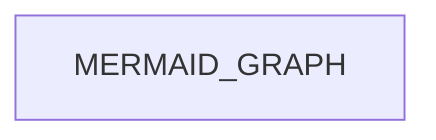
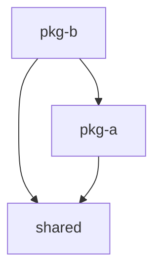

# Workflow: Discover Monorepo

<purpose>
Detect monorepo type, discover workspace packages, and construct dependency graph for GSD.

This workflow enables GSD to understand monorepo structure:
- What type of monorepo (pnpm, turborepo, nx, lerna, rush, npm-workspaces)
- What packages exist and where
- How packages depend on each other
- What build order is required (topological sort)

Output: MONOREPO_INFO variable (JSON) + .planning/MONOREPO_INFO.md (human-readable)
</purpose>

<prerequisites>
<required>
- Project root directory
- Package manager installed (npm, pnpm, or yarn)
</required>

<optional>
- jq for JSON processing (falls back to node)
- pnpm, npm, or yarn CLI
</optional>
</prerequisites>

<process>

<step name="detect_monorepo_type" number="1">
## Step 1: Detect Monorepo Type

Check for monorepo configuration files in priority order.

**Detection order (most popular/specific first):**

```bash
detect_monorepo_type() {
  local dir="${1:-.}"

  # 1. pnpm workspaces (most popular monorepo solution 2024+)
  if [ -f "$dir/pnpm-workspace.yaml" ]; then
    # Check if also using Turborepo
    if [ -f "$dir/turbo.json" ]; then
      echo "pnpm+turborepo"
    else
      echo "pnpm"
    fi
    return
  fi

  # 2. Turborepo (with npm/yarn workspaces)
  if [ -f "$dir/turbo.json" ]; then
    if [ -f "$dir/package.json" ] && grep -q '"workspaces"' "$dir/package.json"; then
      echo "npm+turborepo"
    else
      echo "turborepo"
    fi
    return
  fi

  # 3. Nx
  if [ -f "$dir/nx.json" ]; then
    echo "nx"
    return
  fi

  # 4. Lerna (legacy, now powered by Nx)
  if [ -f "$dir/lerna.json" ]; then
    echo "lerna"
    return
  fi

  # 5. Rush (Microsoft monorepo tool)
  if [ -f "$dir/rush.json" ]; then
    echo "rush"
    return
  fi

  # 6. npm/yarn/bun workspaces (fallback)
  if [ -f "$dir/package.json" ] && grep -q '"workspaces"' "$dir/package.json"; then
    echo "npm-workspaces"
    return
  fi

  # Not a monorepo
  echo "single-package"
}

MONOREPO_TYPE=$(detect_monorepo_type)
echo "Detected monorepo type: $MONOREPO_TYPE"
```

**Config files detected:**

| File | Tool | Ecosystem |
|------|------|-----------|
| `pnpm-workspace.yaml` | pnpm workspaces | pnpm |
| `turbo.json` | Turborepo | npm/pnpm/yarn |
| `nx.json` | Nx | npm/pnpm/yarn |
| `lerna.json` | Lerna | npm/yarn |
| `rush.json` | Rush | pnpm (managed) |
| `package.json` (workspaces field) | npm/yarn/bun workspaces | npm/yarn/bun |

**Result:** MONOREPO_TYPE set to one of: pnpm, pnpm+turborepo, npm+turborepo, turborepo, nx, lerna, rush, npm-workspaces, single-package
</step>

<step name="discover_packages" number="2">
## Step 2: Discover Workspace Packages

Parse workspace configuration to find all packages.

```bash
discover_packages() {
  local type="$1"

  case "$type" in
    pnpm|pnpm+turborepo)
      # Parse pnpm-workspace.yaml
      # Format:
      # packages:
      #   - 'packages/*'
      #   - 'apps/*'
      discover_pnpm_packages
      ;;

    npm-workspaces|npm+turborepo)
      # Parse package.json workspaces field
      discover_npm_packages
      ;;

    nx)
      # Parse nx.json projects
      discover_nx_packages
      ;;

    lerna)
      # Parse lerna.json packages
      discover_lerna_packages
      ;;

    rush)
      # Parse rush.json projects
      discover_rush_packages
      ;;

    single-package)
      # Just the root package
      discover_single_package
      ;;
  esac
}
```

### pnpm Package Discovery

```bash
discover_pnpm_packages() {
  # Extract glob patterns from pnpm-workspace.yaml
  local patterns=$(grep -A50 "packages:" pnpm-workspace.yaml 2>/dev/null | \
    grep "^\s*-" | \
    sed "s/.*['\"]\\(.*\\)['\"].*/\\1/" | \
    sed "s/.*- \\(.*\\)/\\1/")

  # Expand each glob pattern to find package.json files
  local packages=""
  for pattern in $patterns; do
    # Skip negation patterns for now
    if [[ "$pattern" == !* ]]; then
      continue
    fi

    # Find matching directories with package.json
    for pkg_dir in $pattern; do
      if [ -f "$pkg_dir/package.json" ]; then
        local name=$(node -e "console.log(require('./$pkg_dir/package.json').name || '$pkg_dir')")
        local version=$(node -e "console.log(require('./$pkg_dir/package.json').version || '0.0.0')")
        echo "$name|$pkg_dir|$version"
      fi
    done
  done
}
```

### npm/yarn Package Discovery

```bash
discover_npm_packages() {
  # Extract workspaces array from package.json
  node -e "
    const pkg = require('./package.json');
    const workspaces = pkg.workspaces || [];
    const globs = Array.isArray(workspaces) ? workspaces : (workspaces.packages || []);

    const glob = require('glob');
    const path = require('path');

    globs.forEach(pattern => {
      // Skip negation patterns
      if (pattern.startsWith('!')) return;

      const matches = glob.sync(pattern, { cwd: process.cwd() });
      matches.forEach(match => {
        try {
          const pkgJson = require(path.join(process.cwd(), match, 'package.json'));
          console.log(pkgJson.name + '|' + match + '|' + (pkgJson.version || '0.0.0'));
        } catch (e) {
          // Not a valid package
        }
      });
    });
  " 2>/dev/null
}
```

### Nx Package Discovery

```bash
discover_nx_packages() {
  node -e "
    const fs = require('fs');
    const path = require('path');

    // Try workspace.json first, then nx.json
    let projects = {};

    if (fs.existsSync('workspace.json')) {
      const workspace = JSON.parse(fs.readFileSync('workspace.json', 'utf8'));
      projects = workspace.projects || {};
    } else if (fs.existsSync('nx.json')) {
      const nx = JSON.parse(fs.readFileSync('nx.json', 'utf8'));
      // In Nx 15+, projects might be in nx.json or auto-discovered
      if (nx.projects) {
        projects = nx.projects;
      } else {
        // Auto-discover from project.json files
        const glob = require('glob');
        glob.sync('**/project.json').forEach(projectFile => {
          const projectDir = path.dirname(projectFile);
          const project = JSON.parse(fs.readFileSync(projectFile, 'utf8'));
          projects[project.name || projectDir] = projectDir;
        });
      }
    }

    Object.entries(projects).forEach(([name, projectPath]) => {
      const dir = typeof projectPath === 'string' ? projectPath : projectPath.root || name;
      const pkgJsonPath = path.join(dir, 'package.json');

      if (fs.existsSync(pkgJsonPath)) {
        const pkg = JSON.parse(fs.readFileSync(pkgJsonPath, 'utf8'));
        console.log((pkg.name || name) + '|' + dir + '|' + (pkg.version || '0.0.0'));
      } else {
        console.log(name + '|' + dir + '|0.0.0');
      }
    });
  " 2>/dev/null
}
```

### Lerna Package Discovery

```bash
discover_lerna_packages() {
  node -e "
    const lerna = require('./lerna.json');
    const glob = require('glob');
    const path = require('path');

    const patterns = lerna.packages || ['packages/*'];

    patterns.forEach(pattern => {
      glob.sync(pattern).forEach(pkgDir => {
        try {
          const pkg = require(path.join(process.cwd(), pkgDir, 'package.json'));
          console.log(pkg.name + '|' + pkgDir + '|' + (pkg.version || '0.0.0'));
        } catch (e) {}
      });
    });
  " 2>/dev/null
}
```

### Rush Package Discovery

```bash
discover_rush_packages() {
  node -e "
    const rush = require('./rush.json');
    const path = require('path');

    (rush.projects || []).forEach(proj => {
      try {
        const pkg = require(path.join(process.cwd(), proj.projectFolder, 'package.json'));
        console.log((pkg.name || proj.packageName) + '|' + proj.projectFolder + '|' + (pkg.version || '0.0.0'));
      } catch (e) {
        console.log(proj.packageName + '|' + proj.projectFolder + '|0.0.0');
      }
    });
  " 2>/dev/null
}
```

### Single Package (Not Monorepo)

```bash
discover_single_package() {
  if [ -f "package.json" ]; then
    local name=$(node -e "console.log(require('./package.json').name || 'root')")
    local version=$(node -e "console.log(require('./package.json').version || '0.0.0')")
    echo "$name|.|$version"
  fi
}
```

**Result:** List of packages in format: `name|path|version` (one per line)
</step>

<step name="build_dependency_graph" number="3">
## Step 3: Build Dependency Graph

Construct directed graph of workspace package dependencies.

**Algorithm:**

```
1. Create node for each workspace package
2. For each package:
   - Read package.json
   - Get dependencies + devDependencies
   - For each dependency:
     - If dependency name is in workspace packages → add edge
3. Detect cycles (error if found)
4. Compute topological sort (build order)
```

**Implementation approach:**

Use Claude reasoning to construct the graph rather than complex bash. The dependency-graph npm package conceptually provides:
- `addNode(name, data)`: Add package as node
- `addDependency(from, to)`: Add edge (from depends on to)
- `overallOrder()`: Get topological sort
- Automatic cycle detection (throws on cycle)

```bash
build_dependency_graph() {
  local packages_file="$1"

  # Step 1: Read all workspace package names
  local workspace_names=""
  while IFS='|' read -r name path version; do
    workspace_names="$workspace_names $name"
  done < "$packages_file"

  # Step 2: For each package, find workspace dependencies
  echo "{"
  echo "  \"graph\": {"

  local first=true
  while IFS='|' read -r name path version; do
    if [ "$first" != true ]; then
      echo ","
    fi
    first=false

    # Read package.json dependencies
    local deps=$(node -e "
      const pkg = require('./$path/package.json');
      const allDeps = {
        ...pkg.dependencies,
        ...pkg.devDependencies
      };
      const workspaceNames = '$workspace_names'.trim().split(/\\s+/);
      const localDeps = Object.keys(allDeps).filter(d => workspaceNames.includes(d));
      console.log(JSON.stringify(localDeps));
    " 2>/dev/null)

    echo -n "    \"$name\": $deps"
  done < "$packages_file"

  echo ""
  echo "  },"

  # Step 3: Compute topological sort
  # Use Claude reasoning here - the dependency-graph package provides:
  # - overallOrder() for build order
  # - Cycle detection built-in

  echo "  \"buildOrder\": [],"
  echo "  \"cycles\": []"
  echo "}"
}
```

**Cycle Detection:**

If a cycle is detected, report it clearly:

```
ERROR: Circular dependency detected!
  @scope/pkg-a → @scope/pkg-b → @scope/pkg-a

Packages in cycle:
- @scope/pkg-a
- @scope/pkg-b

This must be resolved before builds can proceed.
```

**Topological Sort:**

Use Kahn's algorithm conceptually (as implemented by dependency-graph):
1. Find all packages with no dependencies (sources)
2. Add them to build order
3. Remove their edges from graph
4. Repeat until graph is empty
5. If packages remain, cycle exists

**Result:** Graph structure with dependencies and build order
</step>

<step name="generate_output" number="4">
## Step 4: Generate Output

Create both JSON (machine-readable) and Markdown (human-readable) outputs.

### JSON Output (MONOREPO_INFO variable)

```json
{
  "type": "pnpm+turborepo",
  "root": "/path/to/monorepo",
  "detected": "2026-01-08T12:00:00Z",
  "packages": [
    {
      "name": "@scope/shared",
      "path": "packages/shared",
      "version": "1.0.0"
    },
    {
      "name": "@scope/pkg-a",
      "path": "packages/pkg-a",
      "version": "1.0.0"
    },
    {
      "name": "@scope/pkg-b",
      "path": "apps/pkg-b",
      "version": "1.0.0"
    }
  ],
  "graph": {
    "@scope/shared": [],
    "@scope/pkg-a": ["@scope/shared"],
    "@scope/pkg-b": ["@scope/shared", "@scope/pkg-a"]
  },
  "buildOrder": ["@scope/shared", "@scope/pkg-a", "@scope/pkg-b"],
  "cycles": [],
  "stats": {
    "totalPackages": 3,
    "maxDepth": 2,
    "rootPackages": 1
  }
}
```

### Markdown Output (.planning/MONOREPO_INFO.md)

```bash
generate_monorepo_markdown() {
  local json_data="$1"
  local output_file=".planning/MONOREPO_INFO.md"

  cat > "$output_file" << 'EOF'
# Monorepo Information

**Type:** MONOREPO_TYPE
**Root:** ROOT_PATH
**Detected:** TIMESTAMP
**Packages:** PACKAGE_COUNT

---

## Packages

| Name | Path | Version |
|------|------|---------|
PACKAGE_TABLE

---

## Dependency Graph



---

## Build Order

NUMBERED_BUILD_ORDER

---

## Statistics

- **Total packages:** PACKAGE_COUNT
- **Dependency depth:** MAX_DEPTH levels
- **Root packages (no deps):** ROOT_COUNT

---

*Generated by discover-monorepo workflow*
*Last updated: TIMESTAMP*
EOF

  # Replace placeholders with actual values
  # (Done via sed or node processing)
}
```

**Mermaid Graph Format:**



For large graphs (>20 packages), generate simplified version showing only key paths.
</step>

<step name="display_summary" number="5">
## Step 5: Display Summary

Present discovery results to user:

```bash
echo ""
echo "═══════════════════════════════════════════════════"
echo "MONOREPO DISCOVERED"
echo "═══════════════════════════════════════════════════"
echo ""
echo "Type: $MONOREPO_TYPE"
echo "Packages: $PACKAGE_COUNT"
echo "Build depth: $MAX_DEPTH levels"
echo ""
echo "━━━━━━━━━━━━━━━━━━━━━━━━━━━━━━━━━━━━━━━━━━━━━━━━━"
echo "BUILD ORDER"
echo "━━━━━━━━━━━━━━━━━━━━━━━━━━━━━━━━━━━━━━━━━━━━━━━━━"
echo ""

local num=1
for pkg in $BUILD_ORDER; do
  echo "  $num. $pkg"
  num=$((num + 1))
done

echo ""
echo "━━━━━━━━━━━━━━━━━━━━━━━━━━━━━━━━━━━━━━━━━━━━━━━━━"
echo "OUTPUT"
echo "━━━━━━━━━━━━━━━━━━━━━━━━━━━━━━━━━━━━━━━━━━━━━━━━━"
echo ""
echo "JSON: MONOREPO_INFO variable set"
echo "Markdown: .planning/MONOREPO_INFO.md"
echo ""
echo "═══════════════════════════════════════════════════"
```

**Cycle warning:**

If cycles were detected:

```
⚠️  WARNING: Circular dependencies detected!
    @scope/pkg-a ↔ @scope/pkg-b

    Build order may be incorrect. Fix circular deps before deployment.
```
</step>

</process>

<output>
## Output Format

**Variables set:**
- `MONOREPO_INFO`: JSON string with complete discovery results

**Files created:**
- `.planning/MONOREPO_INFO.md`: Human-readable summary with Mermaid diagram

**JSON structure:**
```typescript
interface MonorepoInfo {
  type: 'pnpm' | 'pnpm+turborepo' | 'npm+turborepo' | 'turborepo' | 'nx' | 'lerna' | 'rush' | 'npm-workspaces' | 'single-package';
  root: string;
  detected: string;  // ISO timestamp
  packages: {
    name: string;
    path: string;
    version: string;
  }[];
  graph: Record<string, string[]>;  // package → dependencies
  buildOrder: string[];  // topological sort
  cycles: string[][];    // cycle paths if any
  stats: {
    totalPackages: number;
    maxDepth: number;
    rootPackages: number;  // packages with no dependencies
  };
}
```
</output>

<error_handling>
## Error Handling

**Not a monorepo:**
- Set type to "single-package"
- Output single package info
- No graph needed

**Missing package.json:**
- Skip that package in discovery
- Log warning: "Package at PATH missing package.json"

**Circular dependencies:**
- Complete discovery with cycles array populated
- Display warning but don't fail
- Build order may be incomplete

**Parse errors:**
- Log specific file that failed
- Continue with partial results
- Set appropriate error flag in output

**No packages found:**
- Error if type is not single-package
- "Workspace config found but no packages matched globs"
</error_handling>

<integration>
## Integration Points

**Used by:**
- `/gsd:discover-monorepo` command (Phase 18-02)
- impact-analysis.md workflow (Phase 18-02)
- Coordinated execution (Phase 19)

**Reads:**
- pnpm-workspace.yaml
- package.json (workspaces field)
- nx.json / workspace.json
- lerna.json
- rush.json
- Individual package.json files

**Outputs to:**
- .planning/MONOREPO_INFO.md
- MONOREPO_INFO variable (for downstream workflows)

**Caches:**
- Consider caching MONOREPO_INFO.md with file modification timestamps
- Re-run discovery if workspace config changed
</integration>

<reference>
## Reference

See `~/.claude/get-shit-done/references/monorepo-patterns.md` for:
- Detailed config file formats
- Workspace glob patterns
- Dependency graph concepts
- Common pitfalls

See `.planning/phases/18-monorepo-discovery/18-RESEARCH.md` for:
- Research findings
- Standard stack
- Code examples
</reference>

---

*Monorepo discovery workflow for GSD*
*Created: 2026-01-08*
